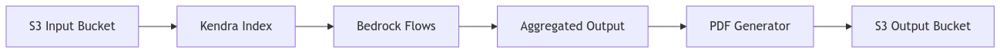
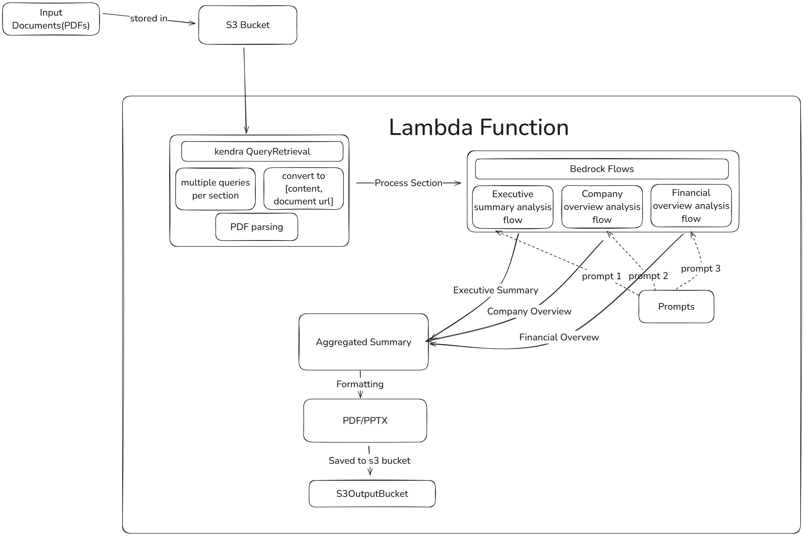

# Investment Committee Deck Generator - PoC Demo

## Overview

This project is a Proof of Concept (PoC) demo for InvestLens from DevDash Labs. The goal is to automate the process of generating investment committee decks using Agentic and AI solution. This README provides a comprehensive overview of the project, including objectives, architecture, setup instructions, and usage details.

## Project Structure

```
generate-investment-committee-deck/
├── demo/                   # Sample inputs/outputs
│   ├── sample_input/       # Example PDFs for processing
│   └── sample_output/      # Generated deck examples
├── img/                    # Architecture diagrams
├── scripts/                # Deployment scripts
│   ├── deploy_lambda_linux.sh
│   └── deploy_lambda.ps1
├── src/                    # Core logic
│   ├── pipeline/           # Data processing flows
│   │   ├── bedrock_flow.py
│   │   ├── deck_generator.py
│   │   └── kendra_flow.py
│   ├── trigger/            # S3 event handlers
│   │   ├── s3_trigger.py
│   │   └── __init__.py
│   └── utils/              # Helper modules
│       ├── pdf_formatter.py
│       └── s3_manager.py
├── env/                    # Environment template
│   └── .env.example
├── .gitignore
├── README.md
├── requirements.txt
└── solution_summary.md
```

This structure separates source code, tests, and configuration files, making the project more organized and maintainable.

## Objective

The primary objective of this PoC is to demonstrate the automation of investment deck generation, which includes:
- Efficiently searching and aggregating relevant documents.
- Generating structured and consistent content for investment decks.
- Formatting the content into professional PDF documents.
- Storing and managing the generated documents in AWS S3.

## Architecture

### High-Level Architecture


### Components
1. **S3 Buckets**: 
   - `your-kendra-bucket`: Stores input documents.
   - `kendra_output/output`: Stores generated investment decks.
2. **AWS Kendra**: Indexes documents for intelligent search.
3. **AWS Bedrock**: Processes data to generate content for different sections of the deck.
4. **AWS Lambda**: Orchestrates the entire process, from data retrieval to PDF generation.
5. **PDF Generator**: Formats the generated content into professional PDF documents.

## Setup Instructions

### Prerequisites
- AWS Account with configured credentials
- Python 3.8+
- Required AWS Services:
  - AWS Bedrock with appropriate permissions
  - AWS Kendra index
  - AWS Lambda
  - AWS S3 buckets
- Required S3 buckets:
  - Input bucket for documents
  - Output bucket for generated decks

### Quick Start

#### 1. Clone Repository
```powershell
git clone <repository-url>
cd generate-investment-committee-deck
```

#### 2. Install Dependencies
```powershell
pip install -r requirements.txt
```

#### 3. Configure AWS
```powershell
aws configure
# Enter your AWS credentials when prompted
```

#### 4. Set Up Environment Variables

Create a `.env` file in the root directory with the following variables:

```env
# Required for AWS Bedrock Flow execution
FLOW_EXECUTION_ROLE_ARN=arn:aws:iam::<account-id>:role/service-role/AmazonBedrockExecutionRoleForFlows

# Required for Kendra and S3
KENDRA_INDEX_ID=your-index-id
INPUT_BUCKET_NAME=your-kendra-bucket
OUTPUT_BUCKET_NAME=kendra_output/output
KENDRA_ROLE_ARN=your-kendra-role-arn

# Required for Lambda deployment
LAMBDA_FUNCTION_NAME_1=InvestorDeckGenerator
LAMBDA_FUNCTION_NAME_2=S3Handler

# Optional
AWS_REGION=us-east-1  # Defaults to us-east-1 if not set

# Environment Configuration
# ------------------------
# ENVIRONMENT: Set to either 'local' or 'None'
# - 'local': For development and testing
#   * Enables automatic flow updates when prompts change
#   * Maintains hash tracking for prompt changes
#   * Suitable for development and testing
#
# - 'None': 
#   * When you're ready to deploy it to the lambda function with set prompts
#   * No hash tracking

ENVIRONMENT=None
```

#### 5. Deploy Lambda Functions

For Linux/Mac:
```sh
./deploy_lambda_linux.sh
```

For Windows:
```powershell
.\deploy_lambda.ps1
```

#### 6. Upload Sample Documents
```powershell
# Upload sample documents to S3
aws s3 cp ./demo/sample_input/company_overview.pdf s3://$env:INPUT_BUCKET_NAME/
aws s3 cp ./demo/sample_input/financial_report.pdf s3://$env:INPUT_BUCKET_NAME/
aws s3 cp ./demo/sample_input/investment_sheet.pdf s3://$env:INPUT_BUCKET_NAME/
aws s3 cp ./demo/sample_input/market_analysis.pdf s3://$env:INPUT_BUCKET_NAME/
```

#### 7. Generate Deck
```powershell
# Windows PowerShell
python src/pipeline/deck_generator.py

# Linux/Mac
python3 src/pipeline/deck_generator.py
```

#### 8. Check Output
```powershell
# Windows PowerShell
aws s3 ls s3://$env:OUTPUT_BUCKET_NAME/

# Linux/Mac
aws s3 ls s3://$OUTPUT_BUCKET_NAME/
```

Expected output:
- IC_deck_[client_name]_[timestamp].pdf (6-8 KB)

## Architecture Diagram


*Figure: Investor Deck Architecture Diagram*

## Detailed Technical Overview

### Input Documents
The process begins with a large number of PDF documents containing critical financial and legal information. These input documents are uploaded to an S3 bucket named `your-kendra-bucket` for further processing.

### Kendra Index
A crucial aspect of this workflow is the use of a Kendra index. Kendra is an AWS service that provides a highly scalable and intelligent search experience across various data sources. For this PoC, `Investor-Deck-kendra-Index` is used. This index acts as the central repository for storing and retrieving the relevant data chunks required for Bedrock flows in generating the investment deck.

### Data Retrieval
The data retrieval process is managed by a Lambda function. This serverless compute service is responsible for performing the following tasks:
- **Query Execution**: The Lambda function utilizes multiple queries to extract relevant data chunks from the `Investor-Deck-kendra-Index`. These queries are specifically designed to target the information needed for the different sections of the investment deck.
- **Data Manipulation**: The retrieved data is then manipulated into a dictionary format, with two key-value pairs: `content` and `document_uri`. This is important for preserving authenticity by ensuring the references in the PDFs are properly maintained.

### Bedrock Flows
The manipulated data is passed to three distinct Bedrock flows, each responsible for generating a specific section of the investment deck:
1. **Executive Summary Analysis Flow**: This flow processes the data to generate the executive summary section of the investment deck.
2. **Company Overview Analysis Flow**: This flow processes the data to generate the company overview section.
3. **Financial Overview Analysis Flow**: This flow processes the data to generate the financial overview section.

Each of these Bedrock flows has a unique prompt that guides the processing and generation of the corresponding section.

### Output Generation
The final step in the workflow involves the following:
1. **Output Concatenation**: The Lambda function concatenates the outputs from the three Bedrock flows, combining the generated content for the different sections.
2. **PDF Conversion**: The concatenated output is then converted to a PDF format, ensuring a cohesive and visually appealing investment deck.
3. **S3 Upload**: The final PDF investment deck is uploaded to a separate S3 bucket named `kendra_output/output`, making it accessible for further use or distribution.

## Sample Files

### Input Documents
Location: `/demo/sample_input/`
- company_overview.pdf
- financial_report.pdf
- investment_sheet.pdf
- market_analysis.pdf

### Output Examples
Location: `/demo/sample_output/`
- IC_deck_2025-01-22_15-01-57.pdf
- IC_deck_2025-01-22_15-10-29.pdf

## Clean Up
```powershell
# Remove test data
aws s3 rm s3://$env:INPUT_BUCKET_NAME/ --recursive
aws s3 rm s3://$env:OUTPUT_BUCKET_NAME/ --recursive
```

## Common Issues

### Hallucination Prevention
- Ensure input documents contain required data.
- Verify Kendra indexing.
- Check prompt formatting.

### PDF Generation
- Verify output bucket permissions.
- Check PDF formatting templates.
- Monitor Lambda timeouts.

## Run on AWS Lambda

You can run the software using the AWS Lambda functions. You need appropriate permissions to run the lambda functions. The system reads files from the source S3 bucket and stores output files in the destination S3 bucket.

### Deploy to AWS Lambda

For Windows:
```powershell
.\deploy_lambda.ps1
```

For Linux/Mac:
```sh
./deploy_lambda_linux.sh
```

### Invoke Lambda Function

For Windows:
```powershell
aws lambda invoke --function-name $env:LAMBDA_FUNCTION_NAME_1 outputfile.txt
```

For Linux/Mac:
```sh
aws lambda invoke --function-name $LAMBDA_FUNCTION_NAME_1 outputfile.txt
```

Ensure that you have the AWS CLI installed and configured with the necessary permissions to deploy and invoke Lambda functions. The environment variables should be set as described in the setup instructions to ensure the correct function names and other configurations are used.

## Limitations and Considerations

### LLM Hallucination
Large Language Models (LLMs) like those used in the Bedrock flows can sometimes generate content that appears plausible but is factually incorrect or nonsensical, a phenomenon known as "hallucination." This can be particularly problematic in financial and legal documents where accuracy is crucial. To mitigate this risk, it is essential to implement robust verification and validation processes, such as manual reviews by subject matter experts or automated checks against trusted data sources. Ensuring the prompts and input data are well-structured and clear can also help reduce the likelihood of hallucinations. Continuous monitoring and updating of the models with new data and feedback are necessary to improve their accuracy and reliability over time.

### AWS Kendra Pricing
AWS Kendra can be expensive, especially when creating multiple indexes. The cost is based on the number of indexes, queries, and the amount of data processed. It's important to carefully plan and optimize the use of Kendra to manage costs effectively. Consider consolidating data into fewer indexes and optimizing query efficiency to reduce expenses. Regularly review your AWS billing and usage reports to ensure that the costs align with your budget and expectations.

## Conclusion

This PoC demonstrates the potential of automating the generation of investment committee decks using AWS services and Python. By following the setup instructions and understanding the architecture, users can efficiently generate professional investment decks, saving time and ensuring consistency. This PoC serves as a foundation for further enhancements and customization based on specific requirements.

---

If you need any assistance, do not hesistate to reach me directly - nitesh.pant@devdashlabs.com 

---

